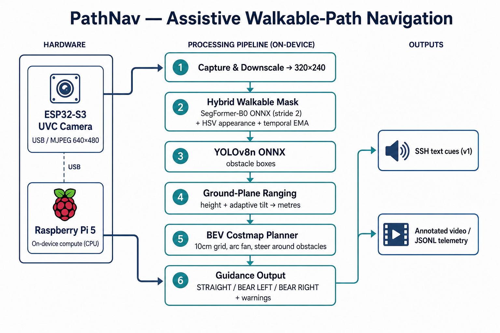
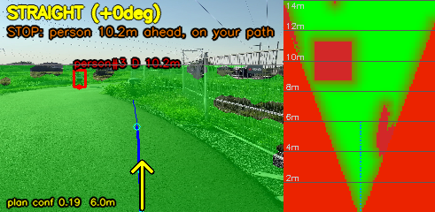
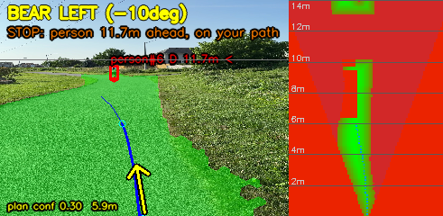

# PathNav

Assistive walkable-path navigation for the visually impaired, running on a Raspberry Pi 5 with an ESP32-S3 camera. It finds the walkable path ahead, estimates obstacle distances in metres, and reports steering cues (`STRAIGHT` / `BEAR LEFT` / `BEAR RIGHT`) plus warnings (`FORK`, `CROSSING AHEAD`, on-path obstacles).



> Detailed project write-up (motivation, design decisions, challenges, results) is in [`PORTFOLIO.txt`](PORTFOLIO.txt).

## Overview

A chest-mounted camera watches the ground; a Raspberry Pi 5 runs two ONNX models (SegFormer-B0 for the walkable mask, YOLOv8n for obstacles), ranges obstacles with a monocular ground-plane model, and plans a route on a bird's-eye costmap. Output is text over SSH for now (audio/TTS is future work). Everything runs on-device — no GPU, no cloud.

## Demo

| Obstacle on path | Path guidance |
|------------------|---------------|
|  |  |

Annotated MP4s and per-frame JSONL are produced locally with `tools/render_test_videos.py` (large binaries are gitignored).

## System architecture

```
ESP32-S3 camera (USB UVC or HTTP MJPEG)
   -> Raspberry Pi 5, downscale 320x240
      -> SegFormer-B0 ONNX (stride 2) + HSV mask + temporal EMA  = walkable mask
      -> YOLOv8n ONNX -> IoU tracker
      -> GroundPlane ranging (height + adaptive tilt)  = metres / bearing / size
      -> BevPlanner (10 cm grid, 31-arc fan)           = steer around obstacles
   -> steering cue + warnings (SSH text; annotated video + JSONL)
```

## Hardware

- **Raspberry Pi 5** — on-device inference + planning
- **ESP32-S3 UVC webcam** — USB (`/dev/video0`, MJPG 640×480) or Wi-Fi MJPEG (`http://<ip>:81/stream`)
- Ranging assumes camera height ≈ 1.41 m, tilt ≈ 18° (adapted online), FOV ≈ 70°

## Software architecture

| Module | Responsibility |
|--------|----------------|
| `path_nav.py` | Orchestrator: models, hybrid mask, horizon/tilt, guidance, I/O |
| `ground_plane.py` | Monocular pixel → metric distance / bearing / size |
| `planner.py` | Image→BEV warp, cost layers, arc scoring, fork/crossing |
| `tracking.py` | IoU multi-object tracker, heading, time-to-contact |

## Challenges (short)

- **Distance from one camera** → ground-plane geometry + adaptive tilt from the horizon (details in `PORTFOLIO.txt`).
- **Reliable walkable mask on real gravel** → hybrid HSV + SegFormer with temporal memory (neural net alone failed).
- **Avoidance without on-device training** → metric bird's-eye costmap + arc planner instead of a learned policy.

## Testing

```bash
python3 tests/test_planner.py          # planner + geometry unit tests
python3 tools/render_test_videos.py    # batch render clips -> MP4 + JSONL
python3 tools/analyze_logs.py          # telemetry metrics
python3 tools/bench_speed.py           # per-stage timing on the Pi
```

## Results

Raspberry Pi 5 (CPU), 6 outdoor clips, stride 2, 320×240:

- ~1.8–1.9 FPS end-to-end (~530 ms models + ~4 ms planning per frame)
- Planner produced a plan on 99.8% of 4341 frames; mean reach ≈ 5.9 m
- Planner geometry unit test: ~3.1 ms/frame (budget < 15 ms)

## How to run

```bash
git clone https://github.com/jinzhu-zhang/vision_project.git
cd vision_project
python3 -m venv .venv && source .venv/bin/activate
pip install -r requirements.txt

# Export / place ONNX models first (see models/README.md), then:
python3 path_nav.py                            # /dev/video0
python3 path_nav.py http://ESP32_IP:81/stream  # network camera
python3 path_nav.py --video walk.mp4 --bev     # replay a clip + costmap panel
```

## Future improvements

- Untethered wearable + spoken directives (TTS)
- Rear/side cameras fused into one bird's-eye costmap
- IMU-based tilt; INT8 quantization / accelerator for real-time
- Minimal Yocto image for deployment

## Repository layout

```
path_nav.py  ground_plane.py  planner.py  tracking.py
tools/   export, bench, eval, batch render, log analysis
tests/   planner geometry unit tests
docs/    architecture diagram + HANDOFF design notes
models/  how to obtain ONNX weights (weights are gitignored)
media/   small demo stills
```

See [`PORTFOLIO.txt`](PORTFOLIO.txt) for the full engineering write-up.
